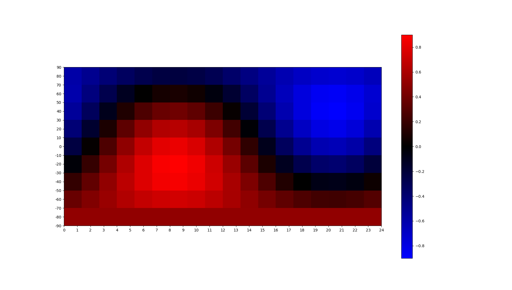

# astrotime

Plot the inverse airmass of the entire sky at your location, averaged over a certain timeframe

## Installation

`python -m pip install -r requirements.txt`

## Usage

Set your LAT_DEGREES and LON_DEGREES to your site location, the STARTTIME and UTC_OFFSET_HOURS to your local time, and set an image scale factor (larger scale requires much more time), then:

`python main.py`
